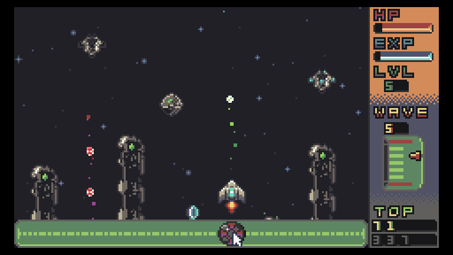

# Quasar Rush (TIC-80)
An arcade space shooter using lua with the TIC-80 fantasy console.

# Instructions
## run
1. Clone repository
2. With TIC-80 cd to dir and load main.lua
3. Make sure IS_EXPORT in main.lua is set to false
4. Run

## export
1. Set IS_EXPORT in main.lua to true
2. Run lua_stich.py
3. Load output file game.lua and test in TIC-80
4. Export to desired format
